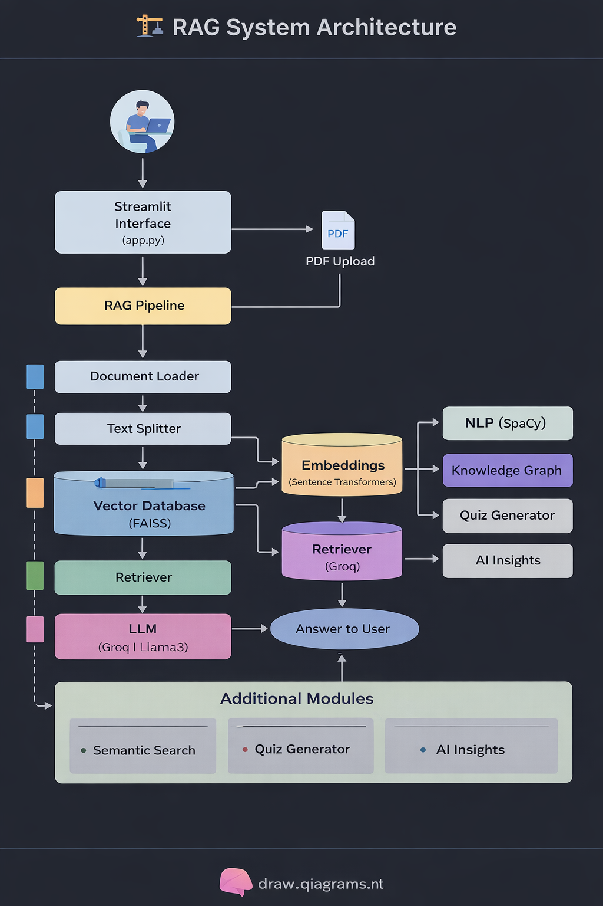
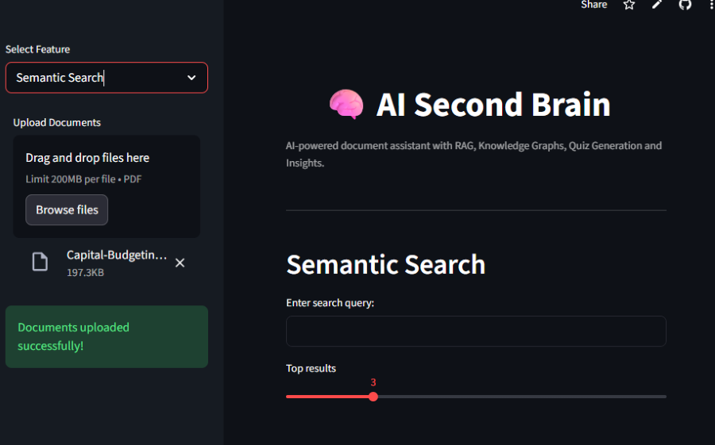
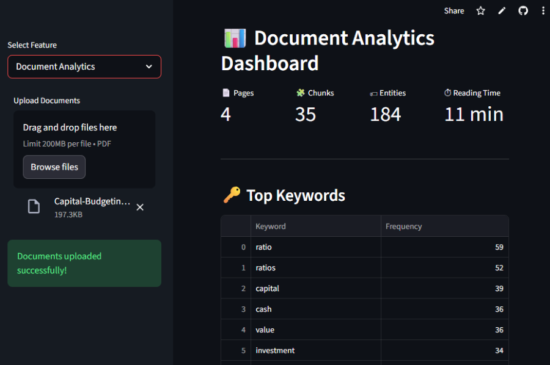
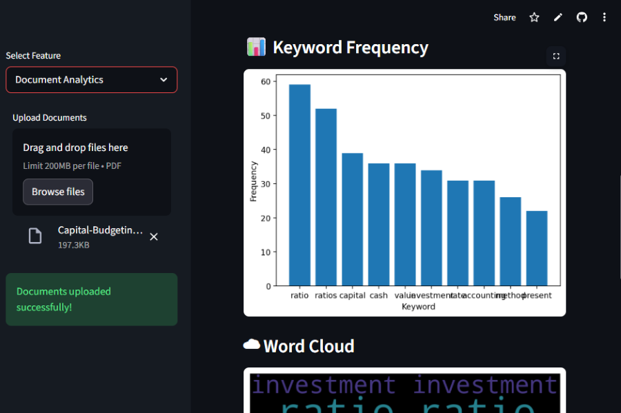
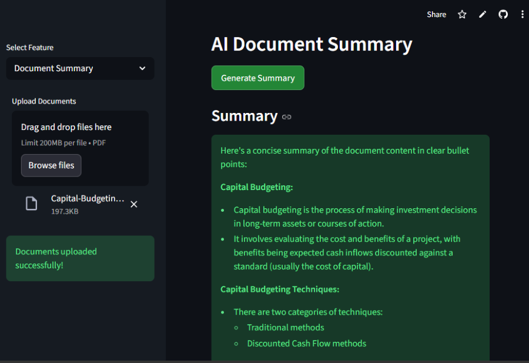

🧠 AI Second Brain

An AI-powered document intelligence system that allows users to upload PDFs and interact with them using Retrieval Augmented Generation (RAG), Knowledge Graphs, Semantic Search, AI Insights, and Document Analytics.

The system transforms static documents into an interactive knowledge assistant capable of answering questions, generating notes, creating quizzes, and visualizing relationships between concepts.

🌐 Live Demo

You can try the application here:

🚀 Live App:
https://ai-second-brain.streamlit.app

(Replace with your deployed link if different.)

🚀 Features
📄 Multi-Document RAG QA

Upload multiple PDFs and ask questions using a Retrieval Augmented Generation pipeline.

🔍 Semantic Search

Find the most relevant document sections using embedding similarity search.

🎤 Voice Question Answering

Ask questions using voice input and receive spoken answers.

🧠 Knowledge Graph Visualization

Automatically extract entities and visualize relationships between concepts.

📝 AI Notes Generator

Generate structured notes from document content.

❓ Quiz Generator

Generate AI-powered multiple choice questions.

📑 Document Summary

Generate concise summaries of uploaded documents.

📊 AI Insights

Extract key topics, entities, and important takeaways.

📈 Document Analytics Dashboard

Includes:

Keyword frequency

Entity distribution

Reading time estimation

Word cloud visualization

💬 Conversation Memory

Maintains chat history and allows conversation summarization.

🏗️ System Architecture

The system follows a Retrieval Augmented Generation (RAG) architecture.

Workflow

User uploads documents

Documents are split into chunks

Embeddings are generated

Vectors are stored in a vector database

User asks a question

Relevant chunks are retrieved

LLM generates answer using retrieved context

The LLM is powered through the API from Groq, while vector similarity search is handled by FAISS.

📸 Application Screenshots
🧠 RAG Question Answering

Ask questions about uploaded documents and receive answers with sources.

🔍 Semantic Search

Find the most relevant document chunks using semantic similarity.

🧠 Knowledge Graph Visualization

Explore relationships between extracted concepts.

❓ AI Quiz Generator

Automatically generate quiz questions from document content.

📊 Document Analytics Dashboard

Analyze documents with keyword charts, entity distribution, and word clouds.

📑 AI Document Summary

Generate concise summaries from uploaded documents.

🧰 Tech Stack
Programming Language

Python

Framework

Streamlit

LLM

Llama 3 via Groq

Vector Database

FAISS

AI / NLP Tools

Whisper (speech recognition)

gTTS (text-to-speech)

spaCy (entity extraction)

Visualization

NetworkX

PyVis

Matplotlib

WordCloud

📁 Project Structure
AI-SECOND-BRAIN
│
├── app.py
│
├── config
│   └── settings.py
│
├── src
│   ├── document_loader.py
│   ├── text_splitter.py
│   ├── embeddings.py
│   ├── vector_store.py
│   ├── llm.py
│   └── rag_pipeline.py
│
├── features
│   ├── knowledge_graph.py
│   └── document_analytics.py
│
├── utils
│   └── voice.py
│
├── documents
│
├── vector_store
│
├── screenshots
│
├── diagrams
│   └── rag_architecture.png
│
└── README.md
⚙️ Installation
1️⃣ Clone Repository
git clone https://github.com/your-username/ai-second-brain.git
cd ai-second-brain
2️⃣ Create Virtual Environment
python -m venv venv

Activate environment

Windows

venv\Scripts\activate

Mac/Linux

source venv/bin/activate
3️⃣ Install Dependencies
pip install -r requirements.txt
4️⃣ Add API Key

Open:

config/settings.py

Add your API key from Groq

GROQ_API_KEY = "your_api_key_here"
▶️ Run Application
streamlit run app.py

The application will start in your browser.

🧪 Example Use Cases

Research paper analysis

AI study assistant

Document intelligence systems

Knowledge base search

Automated learning tools

🌟 Future Improvements

Long-term memory for chat history

Multi-language document support

Web document ingestion

Advanced knowledge graph reasoning

PDF highlighting for answers

🤝 Contributing

Contributions are welcome.

Fork the repository

Create a feature branch

Submit a pull request

📜 License

This project is licensed under the MIT License.

⭐ Support

If you find this project useful, please give it a star on GitHub ⭐

👨‍💻 Author

Atharva Bhalerao

AI & Full-Stack Developer passionate about Generative AI, Machine Learning, and intelligent systems.

💼 LinkedIn: https://www.linkedin.com/in/atharva-bhalerao19

🐙 GitHub: https://github.com/atharvabhalerao0007-crypto

📧 Email: atharvabhalerao0007@gmail.com