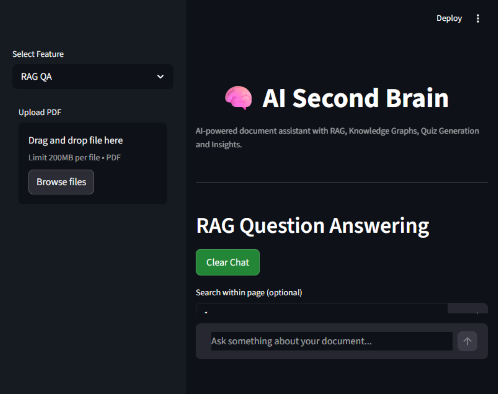
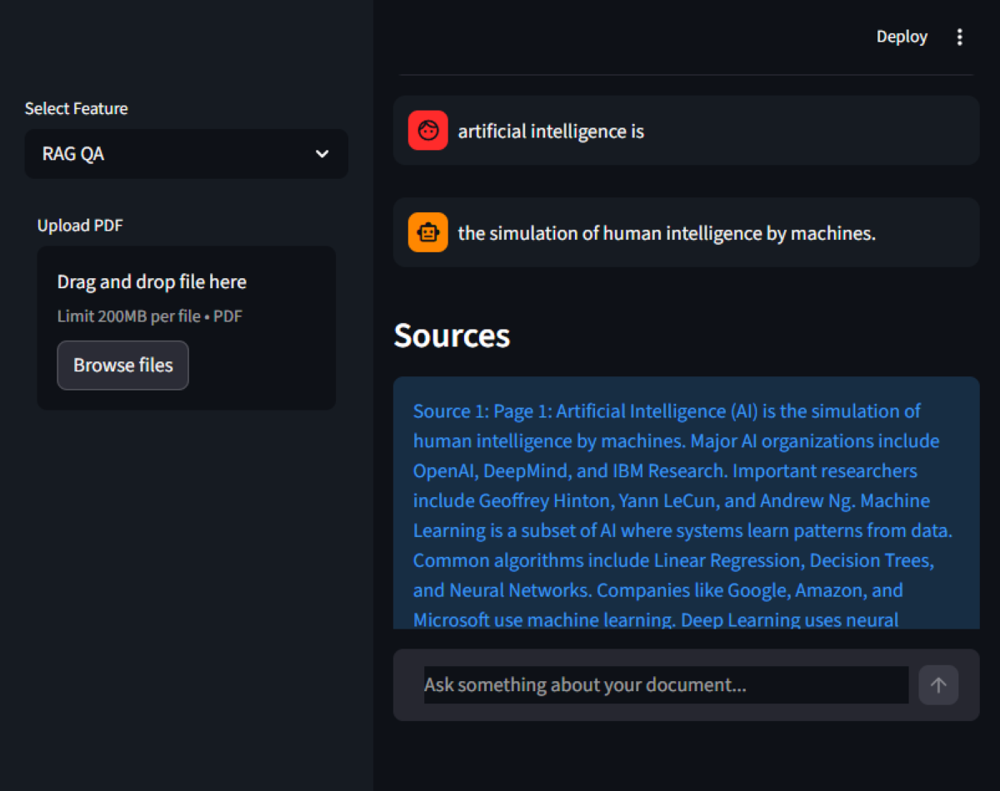
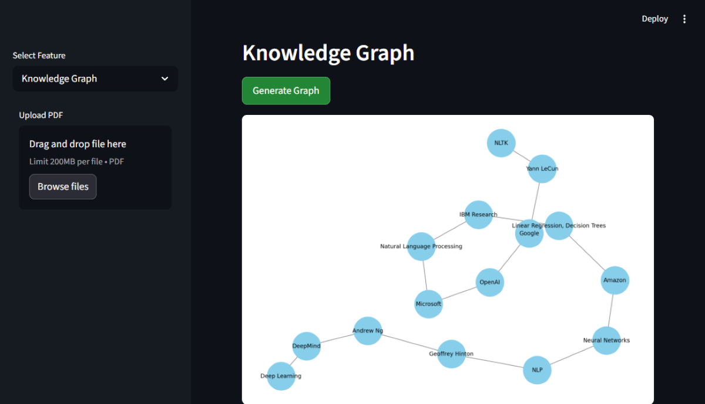
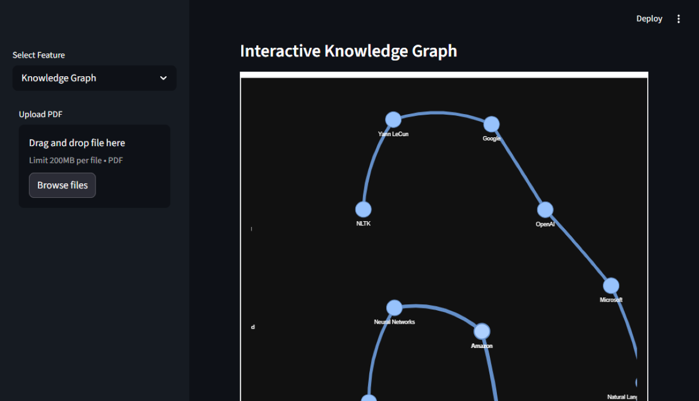
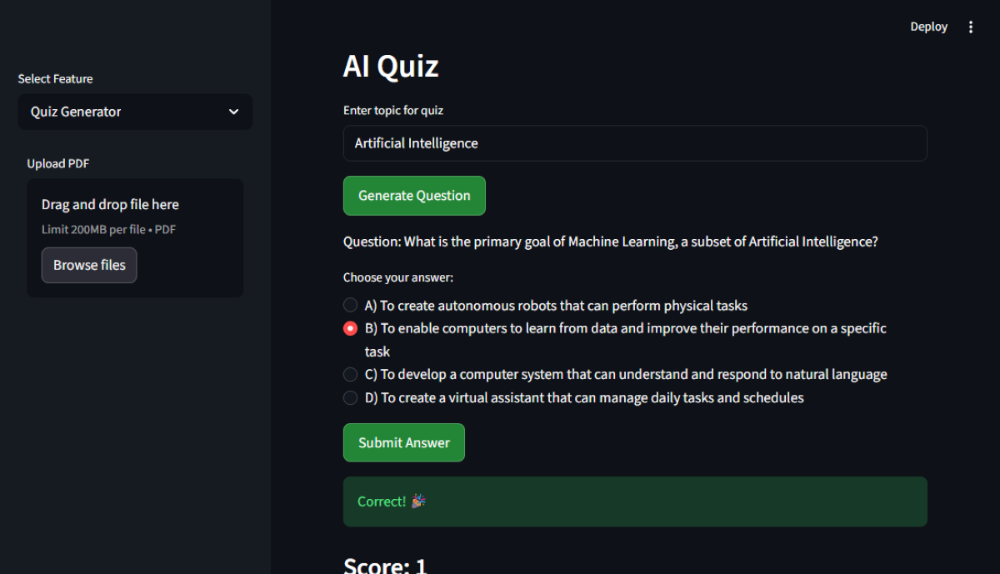
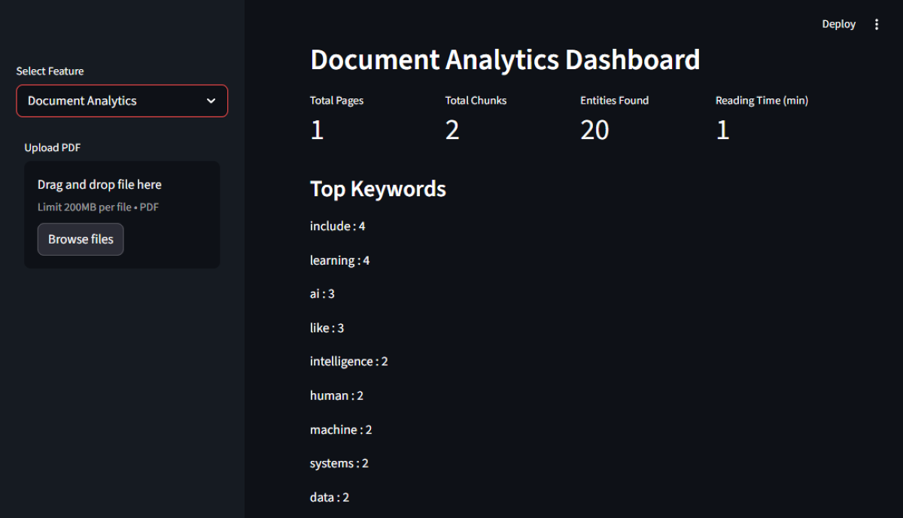

# 🧠 AI Second Brain


AI Second Brain is an **AI-powered document intelligence system** that helps users **understand, analyze, and learn from documents using Generative AI and Retrieval-Augmented Generation (RAG).**

The application allows users to upload documents and interact with them through multiple intelligent AI features such as **Semantic Search, Knowledge Graph Visualization, AI Insights, Quiz Generation, and Document Analytics.**

This project demonstrates how **LLMs, embeddings, vector databases, and retrieval pipelines** can be combined to build a powerful **AI research assistant.**

---

# 🚀 Features

### 📄 Document Upload

Upload PDF documents which are processed and converted into embeddings for semantic understanding.

### 🔎 RAG Question Answering

Ask questions about the uploaded document. The system retrieves relevant context and generates answers using an LLM.

### 🔍 Semantic Search

Perform meaning-based search across the document using vector embeddings to retrieve the most relevant text passages.

### 🧠 AI Insights

Automatically generates key insights and summaries from the uploaded document to help users quickly understand the core ideas.

### 🕸 Knowledge Graph

Extracts entities and relationships from the document and visualizes them as an interactive knowledge graph.

### ❓ Quiz Generator

Automatically generates quiz questions from the document to help users test their understanding.

### 📊 Document Analytics

Provides document statistics like entity counts, word analysis, and structural insights.

---

# 🏗 RAG System Architecture

The following diagram illustrates how the **AI Second Brain** processes documents and generates answers using a **Retrieval-Augmented Generation (RAG) pipeline**.


### Pipeline Overview

1️⃣ User uploads a document through the **Streamlit interface**
2️⃣ The **Document Loader** extracts text from the PDF
3️⃣ The **Text Splitter** divides the document into manageable chunks
4️⃣ **Sentence Transformers** generate vector embeddings
5️⃣ Embeddings are stored in a **FAISS vector database**
6️⃣ The **Retriever** finds the most relevant chunks for a query
7️⃣ The **LLM (Groq / Llama3)** generates the final response

Additional modules such as **Semantic Search, Knowledge Graph, Quiz Generation, and AI Insights** provide deeper interaction with the document.

---

# 🧠 How It Works

The system uses a **Retrieval-Augmented Generation (RAG) pipeline**:

1️⃣ Document Upload
2️⃣ PDF Text Extraction
3️⃣ Text Chunking
4️⃣ Embedding Generation
5️⃣ Vector Storage using FAISS
6️⃣ Semantic Retrieval
7️⃣ LLM Response Generation

This ensures the AI generates answers **grounded in the document content instead of hallucinating information.**

---

# 📸 Application Preview

### 🧠 RAG Question Answering





---

### 🕸 Knowledge Graph Visualization





---

### ❓ Quiz Generator



---

### 📊 Document Analytics



---

# 🏗 Project Structure

```
AI-Second-Brain
│
├── config
│   └── settings.py
│
├── data
│   ├── documents
│   └── vector_store
│
├── diagrams
│   └── rag_architecture.png
│
├── features
│   ├── document_analytics.py
│   ├── knowledge_graph.py
│   ├── notes_generator.py
│   ├── quiz_generator.py
│   └── semantic_search.py
│
├── src
│   ├── document_loader.py
│   ├── embeddings.py
│   ├── llm.py
│   ├── rag_pipeline.py
│   ├── retriever.py
│   ├── text_splitter.py
│   └── vector_store.py
│
├── utils
│   └── helpers.py
│
├── vector_store
│   ├── chunks.pkl
│   └── index.faiss
│
├── screenshots
│   ├── rag_qa.png
│   ├── rag_qa2.png
│   ├── knowledge_graph.png
│   ├── knowledge_graph2.png
│   ├── quiz_generator.png
│   └── document_analytics.png
│
├── app.py
├── initialize_vector_store.py
├── generate_test_pdf.py
├── requirements.txt
├── README.md
└── .env
```

⚠️ Some additional files may exist due to dependency fixes and debugging during development. These are intentionally kept to ensure the application runs correctly.

---

# ⚙️ Installation

### 1️⃣ Clone the Repository

```bash
git clone https://github.com/yourusername/AI-Second-Brain.git
cd AI-Second-Brain
```

---

### 2️⃣ Create Virtual Environment

```bash
python -m venv venv
```

---

### 3️⃣ Activate Virtual Environment

**Windows**

```bash
venv\Scripts\activate
```

**Mac / Linux**

```bash
source venv/bin/activate
```

---

### 4️⃣ Install Dependencies

```bash
pip install -r requirements.txt
```

---

### 5️⃣ Install SpaCy Model

```bash
python -m spacy download en_core_web_sm
```

---

# ▶️ Run the Application

Start the Streamlit app:

```bash
streamlit run app.py
```

The application will open in your browser:

```
http://localhost:8501
```

---

# 🧰 Tech Stack

### AI / Machine Learning

* LangChain
* Sentence Transformers
* Groq LLM
* SpaCy

### Vector Database

* FAISS

### Backend

* Python

### Frontend

* Streamlit

### Data Processing

* PyPDF2
* NumPy
* Pandas

---

# 📈 Future Improvements

* Multi-document RAG support
* Better knowledge graph visualization
* Support for DOCX and TXT documents
* Cloud deployment
* User authentication system

---

# 🎯 Use Cases

* AI Research Assistant
* Document Intelligence Systems
* Study & Learning Assistant
* Knowledge Management Tool

---

# 👨‍💻 Author

**Atharva Bhalerao**

---

# 📜 License

This project is for educational and demonstration purposes.
